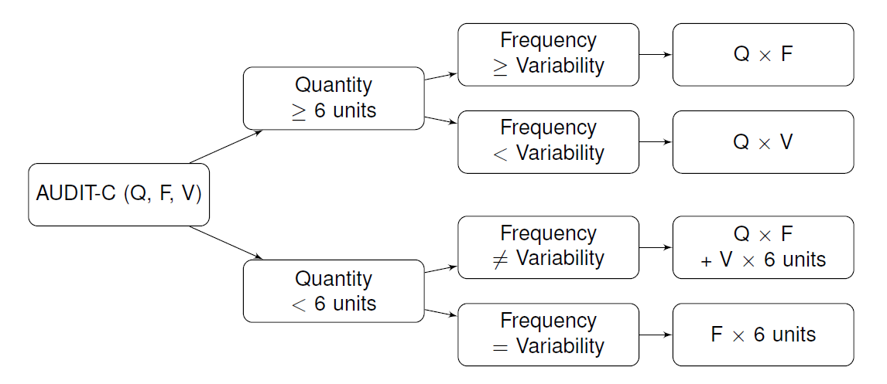

```{r loading data, include=F}
# Loading data
source("../01_src/functions.R")
source("../01_src/filepaths.R")
source("../01_src/audit_weights.R")

library(tidyverse)
library(knitr)
library(captioner)
library(kableExtra)
# library("scales")
# library("xtable")
# library("stargazer")

auditx_labels <- c("audit1_label", "audit2_label", "audit3_label")

load(file.path("..", "02_data", "HSE.rda"))
# hse <- hse[hse$dnnow == 1,] # Take only those drinking 'at all these days'

load(file.path("..", "02_data", "ATS.rda"))
# Too small a sample size too manage
ats$sex[ats$sex == "In another way"] <- NA
ats <- ats %>% 
  mutate(., 
    audit1_label = if_else(.$audit1_label %in% c("Refused", "Don't know"), 
                           NA_character_, audit1_label),
    audit2_label = if_else(.$audit2_label %in% c("Refused", "Don't know"), 
                           NA_character_, audit2_label),
    audit3_label = if_else(.$audit3_label %in% c("Refused", "Don't know"), 
                           NA_character_, audit3_label))


table_nums <- captioner::captioner(prefix = "Tab.")
tab.comparison_schedules <- table_nums(name = "tab_comparison_schedules", 
                        caption = "Alcohol schedules: selective comparison")
tab.overview_datasets <- table_nums(name = "tab_overview_datasets", 
                        caption = "Description of data sources")

```


# Introduction

Alcohol consumption is a significant cause of death and ill health. A number of strategies for prevention (PH24), treatment and harm reduction (CG115). Many of those rely on the use of a screening tool. In the UK, the reference tool is the Alcohol Use Disorders Identification Test (AUDIT) [@Babor2001], a 10-item questionnaire schedule widely employed in clinical practice and clinical research as a diagnostic test for alcohol use disorder (ICD-10 F10.1/F10.2; ICD-11 QE10/6C40.1). The short, 3 consumption item version known as AUDIT-C has proven good predictive capabilities for both: (a) clinical diagnoses (e.g. Composite International Diagnostic Interview, Structured Clinical Interview, Alcohol Use Disorder and Associated Disabilities Interview); and (b) consumption in excess of maximum recommended intakes (e.g. 140g/week in Australia, 112 g/week in UK) in a variety of clinical and community dwelling populations [@DeMeneses-Gaya2009]. 

A variant of the AUDIT-C schedule known as the ‘Extended AUDIT-C’ improves the granularity of the information collected on alcohol consumption, thanks to a greater range of response options in the quantity and frequency items (questions 1 and 2). The Extended AUDIT-C has been used in UK research as part of two trials [@Kaner2013c, @Crane2018] and one continuous household survey [@Beard2015a] to capture greater information on the higher risk drinkers, based on the observation that consumption items are right-truncated.

Neither the AUDIT-C nor the Extended AUDIT-C provide a measure of usual alcohol consumption, which could help individuals understand, monitor and adjust their drinking behaviour. Making individuals more aware of the consumption and associated risk is a key recommendation in the recent literature [@Nutt2014, @Rehm2016] and modern government alcohol policy guidelines [@AU.alcoguidelines2009, @AlcoholCMO2016b].

The aim of the present study is develop and validate an Estimator of usual Weekly Alcohol Consumption in units (EWAC) based on the Extended AUDIT-C. The product of frequency of drinking (AUDIT-C item 1) and quantity of drinking (AUDIT-C item 2) can be used to estimate usual alcohol consumption. In addition, measures of heavy use (AUDIT-C item 3) have been found to improve the consistency of the estimator with other data sources in previous research [@Lemmens1992]. 

This paper reports four distinct empirical studies. Study 1 estimates coefficients to apply to each of the AUDIT-C response items to compute an EWAC using data from a large English household survey, the Alcohol Toolkit Study (ATS). Using the same source, Study 2 models measures of deviation between the EWAC and alcohol consumption as estimated in the survey's graduated-frequency schedule. This analysis seeks to identify measures of bias and variance in the EWAC under the assumption that the graduated-frequency schedule constitutes a gold-standard. Study 3 models the deviation between EWAC and another comparator from the 28-day Timeline Followback in a questionnaire study conducted amongst visitors of an acute hospital based in Southampton, UK. Finally, Study 4 compares the population-wide total and empirical cumulative distribution of alcohol consumption in England using the EWAC,  the ATS graduated frequency schedule, the Health Survey for England, and official statistics on alcohol sales.

# Methods

## Overview of alcohol consumption estimation methods
A fundamental hindrance at the core of alcohol research and care is the absence of a measurement gold standard. A number of instruments exist which have been subjected to concurrent validity analysis instead. A state-of-the art review is available from @Greenfield2000 and summarised in the Table below

```{r tab_comparison_schedules, fig.cap = tab.comparison_schedules}
read.csv("table_comparison_alco_schedules.csv") %>% 
  kable %>%
  kable_styling()

```


Broadly, WD tend to capture the highest alcohol consumption levels, followed by GF and the lowest levels are recorded by QF measures [@Heeb2005, @Rehm1998]. A large investigation conducted as part of the Health Survey for England (HSE) [@Boniface2014] compared a WD with an interview-based specific-beverage QF method underpinning the UK national statistics on alcohol consumption. The authors found consistent mean weekly drinking estimates in the two methods, with most differences being associated with drink type and venue.

The present paper employs four sources of data. An overview is available in Table 1 below, together with references to publicly available methodological descriptions. Only the hospital study was conducted specifically for this paper and requires further description. Participants were recruited from a range of clinics at a large acute hospital in Southampton, UK: orthopaedics outpatient, endoscopy day cases, young adult outpatient, infusion ???. 

```{r tab.overview_datasets, fig.cap = table_overview_datasets}
read.csv("table_overview_datasets.csv") %>% 
  kable %>%
  kable_styling()

```

All results are reported in UK alcohol units (8g or 10mL of pure alcohol). Analyses are conducted in `R` [@RCoreTeam2017] using packages `tidyverse`, `survey`, `rstan` [@package-tidyverse; @package-rstan; @package-survey; @Lumley2004]. Computer programmes for all analyses are available on an online repository.


## Study 1: EWAC estimation

Previous research on quantity-frequency alcohol instruments suggests that the product of the quantity and frequency questions in the AUDIT-C (AUDIT items 1 and 2) could be used to produce a measure of usual consumption [@Lemmens1992].



To replicate this approach, we determine coefficients to be applied to each Extended AUDIT-C response item in order to compute the EWAC.

- using the AUDIT-C response item interval midpoint: for example, 2 to 3 times per week is set to 2.5 times per week
- using a statistical model to estimate the coefficients directly from the ATS. Missing data in the GF schedule (14.7% of participants giving a non-'Never' answer to the AUDIT-C item 1) is assumed to be missing at random conditionally on the Extended AUDIT-C responses. We employ a Bayesian hierarchical fitted in STAN setting uniform priors on the value of each AUDIT-C item. Detail is available in supplementary materials.

## Study 2: Concurrent consistency with Graduated Frequency in England

Next, we quantify the deviation between the EWAC and the GF schedule. A pre-registered protocol for this analysis is available from @Dutey2018. Succintly, this analysis treats GF like a gold standard. It enables the examination of two types of deviations across every participant $i$ in the ATS sample:

- MD: the mean deviation $$\sum_{i=1}^{n}{n^{-1}(\rm{EWAC_i} - \rm{GF_i} )}$$ can be assimilated to a measure of bias under the assumption that GF is a gold standard.
- RMSD: the root mean squared deviation $$\sum_{i}{\sqrt{( \rm{EWAC_i} - \rm{GF_i} )^2}}$$ can be assimilated to a measure of total error: it capture both bias and random deviation from the gold standard.

We test the hypothesis that the EWAC's validity varies across population subgroups by regressing both (a) the simple deviation and (b) the root squared deviation in linear regression models, against the following predictors: sex by age group; ethnic group; favourite drink (wine, beer, etc.); highest educational qualification; religion; smoking status; general health; recent attempts at reducing or stopping drinking.


## Study 2: 

This study is predominantly interested in 


```{r}
ats$ewac_stan <- proc_EWAC(ats[, auditx_labels],
                           audit_coef = audit_weights_STAN, method = "qfv")
ats$ewac_mp <- proc_EWAC(ats[, auditx_labels],
                           audit_coef = audit_weights_midpoints, method = "qfv")
ats$ewac_v3<- proc_EWAC(ats[, auditx_labels],
                        audit_coef = audit_weights_version4 , method = "qfv")
ats %>% 
  select(gfmeanweekly, ewac_mp) %>% na.omit %>% 
ggplot(aes(gfmeanweekly, ewac_mp)) +
  geom_point() +
  geom_abline() +
  geom_smooth(method='lm',formula=y~x) +
  theme_bw() +
  ylab("EWAC (UK units/week)") +
  xlab("Graduated-Frequency schedule (UK units/week)")+
  ggtitle("Midpoint coefficients") +
  scale_x_continuous(breaks = seq(0, 150, 10), limits = c(0, 150), minor_breaks = F)+
  scale_y_continuous(breaks = seq(0, 150, 10), limits = c(0, 150), minor_breaks = F)  

```


## Aggregate comparison with ONS schedule and alcohol sales data


# Results

```{r}
library(sjPlot)
lm_bias_mp <- lm((ewac_mp-gfmeanweekly)  ~ ageg*sex+ favdrink + ethgrp, data = ats)
lm_bias_stan <- lm((ewac_stan-gfmeanweekly)  ~ ageg*sex + favdrink + ethgrp, data = ats)

tab_model(lm_bias_mp,lm_bias_stan, file="output_lm_bias.html")
htmltools::includeHTML("output_lm_bias.html")

```


```{r}
lm_rmse_mp <- lm(sqrt((ewac_mp-gfmeanweekly)^2) ~ favdrink + ethgrp + ageg*sex, data = ats)
lm_rmse_stan <- lm(sqrt((ewac_stan-gfmeanweekly)^2) ~ favdrink + ethgrp + ageg*sex, data = ats)
tab_model(lm_rmse_mp,lm_rmse_stan, file="output_lm_rmse.html")
htmltools::includeHTML("output_lm_rmse.html")
```


## Empirical distribution functions


<!-- | Study     | Mean (units/week)     | Median | Variance | N | -->
<!-- | ----------| ---------------------:| --------:|--------:| ----: | -->
<!-- | HSE (all)      | `r tbrounding(mean(hse$totalwu, na.rm =T),1)`   | `r tbrounding(median(hse$totalwu, na.rm =T),1)`     | `r tbrounding(var(hse$totalwu, na.rm =T),1)` |  `r sum(!is.na(hse$totalwu))` | -->
<!-- | HSE diary | `r tbrounding(mean(hse$weektot, na.rm =T),1)`   | `r tbrounding(median(hse$weektot, na.rm =T),1)`     | `r tbrounding(var(hse$weektot, na.rm =T),1)` |  `r sum(!is.na(hse$weektot))` | -->
<!-- | ATS QF    | `r tbrounding(mean(ats$gfmeanweekly, na.rm =T),1)`   | `r tbrounding(median(ats$gfmeanweekly, na.rm =T),1)`   | `r tbrounding(var(ats$gfmeanweekly, na.rm =T),1)` |  `r sum(!is.na(ats$gfmeanweekly))` | -->


```{r echo=F, fig.height=10, fig.width=15}
library(latticeExtra)
library(scales)
xlims = c(-3, 153)
EWAC <- ecdfplot(na.omit(ats$qfv[ats$qfv > 0]),
                key= keyABH, panel = function(x, f.value = NULL, type = "s",
                                              groups = NULL, qtype = 7, ref = TRUE,...) {
                  panel.ecdfplot(x, f.value = NULL, type = "s",
                                 groups = NULL, qtype = 7,
                                 ref = TRUE,...)
                  panel.abline(v = 14)
                },
                xlim = xlims, col = alpha("orange", .7), lwd = 3, lty = 1,
                scales=list(cex=1.5), xlab = ecdfxlab, ylab = ecdfylab)

GF <- ecdfplot(na.omit(ats$gfmeanweekly[ats$gfmeanweekly > 0]),
                key= keyABH, panel = function(x, f.value = NULL, type = "s",
                                              groups = NULL, qtype = 7, ref = TRUE,...) {
                  panel.ecdfplot(x, f.value = NULL, type = "s",
                                 groups = NULL, qtype = 7,
                                 ref = TRUE,...)
                  panel.abline(v = 14)
                },
                xlim = xlims, col = alpha("black", .7), lwd = 3, lty = 1,
               scales=list(cex=1.5), xlab = ecdfxlab, ylab = ecdfylab)

HSE <- ecdfplot(na.omit(hse$totalwu[hse$dnnow == 1]),
                key= keyABH, panel = function(x, f.value = NULL, type = "s",
                                              groups = NULL, qtype = 7, ref = TRUE,...) {
                  panel.ecdfplot(x, f.value = NULL, type = "s",
                                 groups = NULL, qtype = 7,
                                 ref = TRUE,...)
                  panel.abline(v = 14)
                },
                xlim = xlims, col = alpha("red", .7), lwd = 1, lty = 1,
                scales=list(cex=1.5), xlab = ecdfxlab, ylab = ecdfylab)

HSEdiary <- ecdfplot(na.omit(hse$weektot[hse$dnnow == 1]),
                key= keyABH, panel = function(x, f.value = NULL, type = "s",
                                              groups = NULL, qtype = 7, ref = TRUE,...) {
                  panel.ecdfplot(x, f.value = NULL, type = "s",
                                 groups = NULL, qtype = 7,
                                 ref = TRUE,...)
                  panel.abline(v = 14)
                },
                xlim = xlims, col = alpha("red", .7), lwd = 2, lty = 2,
                scales=list(cex=1.5), xlab = ecdfxlab, ylab = ecdfylab)

HSEdiary + HSE +EWAC + GF

```


```{r, echo=F, fig.height=8, fig.width=11}
plot(ats$qfv,  ats$gfmeanweekly, pch =16, col = alpha(1, .2),
     ylab = "GF (units/week)", xlab = "EWAC (units/week)", main = NULL,
     xlim = c(0, 50), ylim = c(0,50))
abline(0,1, col = 2, lwd =1.5)
```


## Regression analysis

```{r echo =F}

#mbias <- lm(qfv-gfmeanweekly ~ as_factor(agez) + as_factor(sexz) + as_factor(favdrink), data = ats) #[gfmeanweekly <20,]
# ats$alcorisk <- cut(ats$auditc_score, breaks = c(1, 4, 8, 13))
# levels(ats$alcorisk) <- c("Low", "Increased", "Higher")
# mbias <- lm(qfv-gfmeanweekly ~ as_factor(ageg) + sex + favdrink + (alcorisk), data = ats)
#  tab3 <- stargazer(mbias, title="Bias regression results",
#                      align=TRUE, type = "html",style = "ajs")
#  
# merr <- lm((qfv-gfmeanweekly)^2 ~ as_factor(ageg) + sex + favdrink + (alcorisk), data = ats)
#  tab4 <- stargazer(mbias, title="MSE regression results",
#                      align=TRUE, type = "html",style = "ajs")
# #kable(tab2)
# kable(xtable(mbias))
#  kable(xtable(merr))
```


# Discussion

- GF not missing at random. Impute the `r round(3883/(3883+22376)*100, 1)`% missing cases

The three sources of information used in this validation measure different constructs: the HSE quantity-frequency does not capture variability, whereas the HSE weekly diary and the ATS graduated frequency schedule do. The HSE diary should nevertheless exhibit smaller recall error.


This paper adopted a QFV approach to compute the EWAC over arguably more direct approaches possible with the ATS, such as supervised machine learning or direct estimation of the mean alcohol consumption for every observed combination of Extended AUDIT-C responses. Although cumbersome, the deterministic nature of the QFV algorithm is meant to be easier to estimate with small training datasets. It is also easier to implement in relational databases employed in electronic record systems compared to many manchine learning techniques.

## Limitations

Findings reported in this paper only concern adult residents of private households in England, and may not generalise to other countries, age groups, or residing in health care or criminal facilities. The ATS is a computer-assisted personal interview survey, which may improve data quality for the Extended AUDIT compared with, for instance, a self-administered Extended AUDIT in a health care context. During data collection, we recorded a frequent confusion with the AUDIT's item 1: some participants being confused as to whether the question refers to number of days in which alcohol has been consumed, or number of occasions on any given day. We believe this to be a common occurrence when the AUDIT is self-administered.

The ATS presents some limitations. First, the high levels of data missingness and the exclusion of respondents answering 'Never' in AUDIT item 1 constituted a high risk of introducing bias in Study 1. Second, there is to our knowledge no validation data available for the ATS graduated-frequency schedule. For these reasons, basing the EWAC on ATS alone would have been hazardous. Such inferential risks are nevertheless addressed in the present paper through Study 3, through data collected from a health care setting, which low levels of missingness, using a different alcohol schedule known to exhibit more variability, but lower bias.

# Tables


Table 1:  <a name="table1"></a>Overview of alcohol schedule used in this paper.

<table style="width:100%;">
<colgroup>
<col width="20%">
<col width="80%">
</colgroup>
<thead>
<tr class="header">
<th>Survey module</th>
<th>Schedule</th>
</tr>
</thead>
<tbody>
<tr class="odd">
<td><em>ATS QF module</em></td>
<td><ul>
<li>On how many days, if any, did you personally drink a drink containing alcohol in the last four weeks?</li>
<li>What was the maximum number of units you personally consumed on any one day when drinking an alcoholic drink or drinks in the last four weeks?</li>
<li>On how many days, if any, in the last four weeks did you personally drink… [prompting in turn &#39;51-60 units?&#39;, &#39;41-50 units?&#39;, …, &#39;1-2 units?</li>
</ul>
</tr>
<tr class="even">
<td align="center"><em>Health Survey for England</em></td>
<td><ul>
<li>Thinking now about all kinds of drinks, how often have you had an alcoholic drink of any kind during the last 12 months? <em>[8 items from &#39;Almost every day&#39; to &#39;Not at all in the last 12 months&#39;]</em></li>
<li>Did you have an alcoholic drink in the seven days ending yesterday?</li>
<li>On how many days out of the last seven did you have an alcoholic drink?</li>
<li>Which day last week did you last have an alcoholic drink/have the most to drink?</li>
<li>Thinking about last [answer to previous question], what types of drink did you have that day? [list of 8 types of alcohol beverages]</li>
<li>[running through each type of beverage and recording number of units drunk]</li>
</ul></td>

</tr>
</tbody>
</table>


# References